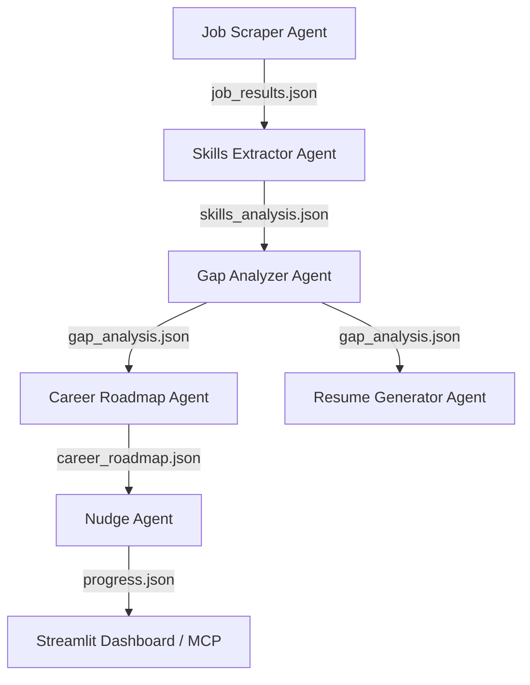

# 🎓 CareerReady Agent

> **Know your gap. Close it. Get hired.**

[](https://www.python.org/)
[](https://opensource.org/licenses/MIT)
[](https://github.com/google/antigravity)
[](https://modelcontextprotocol.io)
[](https://streamlit.io/)

---

## 📌 Problem Statement

In today's fast-paced job market, students, career switchers, and job seekers face significant hurdles:
* **Market Misalignment**: Standard university curriculums and online tutorials rarely align with real-time requirements in active job listings.
* **Invisible Skills Gap**: Candidates struggle to gauge their readiness level for a target role or identify which skills will give them the highest return on investment (ROI).
* **Untargeted Resumes**: Job seekers submit generic resumes that fail to highlight the specific competencies employers look for, leading to automated ATS rejections.
* **Lack of Accountability**: Without a structured learning plan and continuous motivational feedback, self-paced learning journeys often stall.

---

## 💡 Solution Overview

**CareerReady Agent** is an end-to-end multi-agent ecosystem designed to act as a personal career concierge. Powered by the **Google Antigravity SDK (Gemini API)** and standard **Model Context Protocol (MCP)** tools, the system automatically analyzes real-time job market postings to guide users through their career preparation journey. 

The platform operates in a cohesive pipeline:
1. **Analyze the Market**: Scrape real-time job openings for your target role.
2. **Identify Competencies**: Standardize and rank skills demanded by employers.
3. **Assess Readiness**: Quantify your skills gap with a weighted readiness score out of 100.
4. **Learn and Track**: Generate weekly roadmap milestones and track progress with interactive nudges.
5. **Optimize Applications**: Produce a custom, ATS-friendly resume tailored to close the gap.
6. **Integrate Everywhere**: Expose insights to LLM host applications using standard MCP protocols.

---

## ✨ Key Features

* **Real-time Job Scraping**: Search live openings using the JSearch API (via RapidAPI), with a fallback to realistic mock-generation in demo mode.
* **AI-Powered Skill Standardization**: Parse unstructured job descriptions to extract clean, standardized technical and soft skill frequencies using Google Gemini.
* **Weighted Readiness Assessment**: Calculate job readiness based on skill importance levels (High = 3, Medium = 2, Low = 1) and output clear gap summaries.
* **Personalized AI Career Roadmaps**: Receive priority-ranked learning plans with direct links to free high-quality resources (Coursera, YouTube, official documentation).
* **Conversational Progress Nudges**: Log weekly progress interactively and receive motivational encouragements explaining why pending skills are important.
* **ATS-Tailored Resume Builder**: Assemble plain-text resumes highlighting matched competencies and professional summary sections based on the gap analysis.
* **Model Context Protocol Integration**: Host an MCP FastMCP server exposing tools like `search_jobs`, `get_trending_skills`, and `get_market_pulse`.
* **Streamlit Visual Dashboard**: A beautiful visual interface to view readiness analytics and progress metrics (in `dashboard/app.py`).

---

## 🏗️ Architecture Overview

The platform uses a modular, cooperative architecture composed of **6 specialized agents** orchestrated using the Google Antigravity SDK:



### 1. 🔍 Job Scraper Agent (`agents/job_scraper_agent.py`)
* **Role**: Collects raw market demand signals.
* **Function**: Accepts user input for a target role, queries the JSearch API, and writes the raw job posting details (title, company, description, location) to `job_results.json`. Falls back to mock listings if RapidAPI credentials are not present.

### 2. 📊 Skills Extractor Agent (`agents/skills_extractor_agent.py`)
* **Role**: Structures unstructured data.
* **Function**: Reads `job_results.json`, uses Gemini to extract and standardize key technical/soft skills across listings, counts occurrences to find market frequencies, and saves a ranked dictionary to `skills_analysis.json`.

### 3. 🎯 Gap Analyzer Agent (`agents/gap_analyzer_agent.py`)
* **Role**: Computes readiness metrics.
* **Function**: Prompts the user for their current skill set, loads requirements from `skills_analysis.json`, calculates a weighted readiness score out of 100, separates matched and missing skills, and saves the diagnostic report to `gap_analysis.json`.

### 4. 🗺️ Career Roadmap Agent (`agents/career_roadmap_agent.py`)
* **Role**: Formulates structured training curricula.
* **Function**: Reads `gap_analysis.json`, identifies the user's missing skills, structures them by learning priority, compiles free learning resources (documentation, YouTube playlists, Coursera courses), and drafts a week-by-week plan saved in `career_roadmap.json`.

### 5. 🔔 Nudge Agent (`agents/nudge_agent.py`)
* **Role**: Acts as a virtual accountability coach.
* **Function**: Prompts the user to report their weekly goal achievements, compares inputs to the week-by-week roadmap, increments completion status in `progress.json`, and outputs AI-driven feedback containing congratulations or reminders of the skill's importance.

### 6. 📝 Resume Generator Agent (`agents/resume_generator_agent.py`)
* **Role**: Polishes candidate profiles.
* **Function**: Collects user details (education, experience, current skills) and reads `gap_analysis.json`. Orchestrates a tailored, ATS-friendly plain-text resume emphasizing matched keywords and saves the resulting document in `resume_output.txt`.

---

## 🛠️ Tech Stack

* **Programming Language**: [Python 3.8+](https://www.python.org/)
* **AI & Agent Orchestration**: [Google ADK (Antigravity SDK)](https://github.com/google/antigravity) (Leveraging Gemini model endpoints)
* **Model Integration Protocol**: [Model Context Protocol (MCP)](https://github.com/modelcontextprotocol) via standard FastMCP
* **Development Assistant**: **Antigravity** (Autonomous pairing agent)
* **Web UI Dashboard**: [Streamlit](https://streamlit.io/) (Visual UI manager)

---

## ⚙️ Environment Variables Needed

The agents require API key configurations to communicate with external APIs. Create a `.env` file in the root directory:

```env
# Google Gemini API Key (Required for Google Antigravity Agents)
GEMINI_API_KEY=your_gemini_api_key_here

# JSearch API Key (Optional. If not set, runs in Demo Mode using high-quality mock data)
RAPIDAPI_KEY=your_rapidapi_key_here
```

---

## 📥 Installation Instructions

### 1. Clone the Repository
```bash
git clone https://github.com/k-shankar0905/CareerReady-Agent.git
cd CareerReady-Agent
```

### 2. Set Up a Virtual Environment
**On Windows:**
```powershell
python -m venv venv
venv\Scripts\activate
```
**On macOS/Linux:**
```bash
python3 -m venv venv
source venv/bin/activate
```

### 3. Install Dependencies
```bash
pip install -r requirements.txt
# If requirements.txt is not yet generated, install core dependencies:
pip install requests python-dotenv streamlit mcp "mcp[cli]" google-antigravity
```

### 4. Configure Your Keys
Copy the example template file and insert your active API keys:
```bash
cp .env.example .env
```

---

## 🚀 How to Run

### Phase 1: Market Intelligence & Skills Extraction
1. **Run the Job Scraper Agent**:
   ```bash
   python agents/job_scraper_agent.py
   ```
   *Prompt: Type your target role (e.g., `Data Analyst`). Output saved to `job_results.json`.*

2. **Run the Skills Extractor Agent**:
   ```bash
   python agents/skills_extractor_agent.py
   ```
   *Extracts and ranks industry competencies. Output saved to `skills_analysis.json`.*

---

### Phase 2: User Analysis & Learning Path
3. **Run the Gap Analyzer Agent**:
   ```bash
   python agents/gap_analyzer_agent.py
   ```
   *Prompt: Enter your current skills (e.g., `Python, Excel`). Output saved to `gap_analysis.json`.*

4. **Run the Career Roadmap Agent**:
   ```bash
   python agents/career_roadmap_agent.py
   ```
   *Generates prioritized week-by-week curriculum links. Output saved to `career_roadmap.json`.*

---

### Phase 3: Accountability & Application Delivery
5. **Track Progress with the Nudge Agent**:
   ```bash
   python agents/nudge_agent.py
   ```
   *Interactively logs achievements. Updates saved to `progress.json`.*

6. **Generate a Tailored Resume**:
   ```bash
   python agents/resume_generator_agent.py
   ```
   *Tailors profile elements. Plain-text ATS-friendly resume output saved to `resume_output.txt`.*

---

### Phase 4: Interface & Protocol Hosting
7. **Run the Model Context Protocol (MCP) Server**:
   ```bash
   python mcp/job_mcp_server.py
   ```
   *Runs the stdio transport server. Register this server in your Claude Desktop configuration (`claude_desktop_config.json`):*
   ```json
   {
     "mcpServers": {
       "job-market-mcp": {
         "command": "python",
         "args": ["c:/Users/yamuna/.antigravity-ide/CareerReady-Agent/mcp/job_mcp_server.py"]
       }
     }
   }
   ```

8. **Run the Streamlit Dashboard**:
   ```bash
   streamlit run dashboard/app.py
   ```
   *Launches the browser-based visualization page showing your roadmaps, progress, and market charts.*

---

## 📂 Project Structure

```
CareerReady-Agent/
├── agents/
│   ├── career_roadmap_agent.py    # Generates personalized learning paths
│   ├── gap_analyzer_agent.py      # Analyzes readiness score and skill gap
│   ├── job_scraper_agent.py       # Scrapes JSearch API / falls back to mock jobs
│   ├── nudge_agent.py             # Tracks learning progress with custom nudges
│   ├── resume_generator_agent.py  # Builds tailored ATS-friendly resumes
│   └── skills_extractor_agent.py  # Extracts/standardizes skills from jobs
├── dashboard/
│   └── app.py                     # Streamlit dashboard interface
├── mcp/
│   └── job_mcp_server.py          # FastMCP server exposing job market tools
├── skills/
│   └── SKILL.md                   # Skills markdown documentation
├── .env                           # Environment variables configuration
├── .env.example                   # Template for environment variables
├── career_roadmap.json            # Generated roadmap data
├── gap_analysis.json              # Generated gap analysis reports
├── job_results.json               # Raw scraped job postings
├── progress.json                  # Weekly progress tracking database
├── resume_output.txt              # Tailored ATS text resume output
├── skills_analysis.json           # Extracted skill statistics
├── main.py                        # Main entry point (placeholder)
└── README.md                      # Project documentation (this file)
```

---

## 👥 Team Members

* 🎓 **Kothapalli Gowri Shankar**
* 🎓 **Miriyala Jashmitha**
* 🎓 **Maddu Yamuna**
* 🎓 **Maddela Aashritha**

---

## 📄 License

This project is licensed under the MIT License - see the [LICENSE](LICENSE) file for details.
